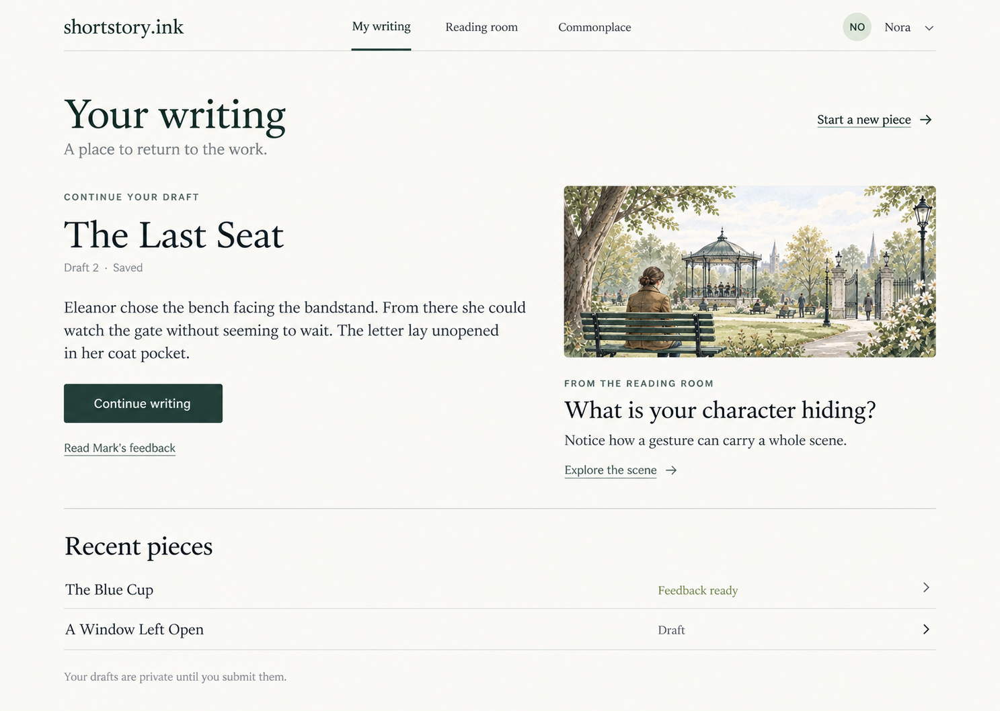
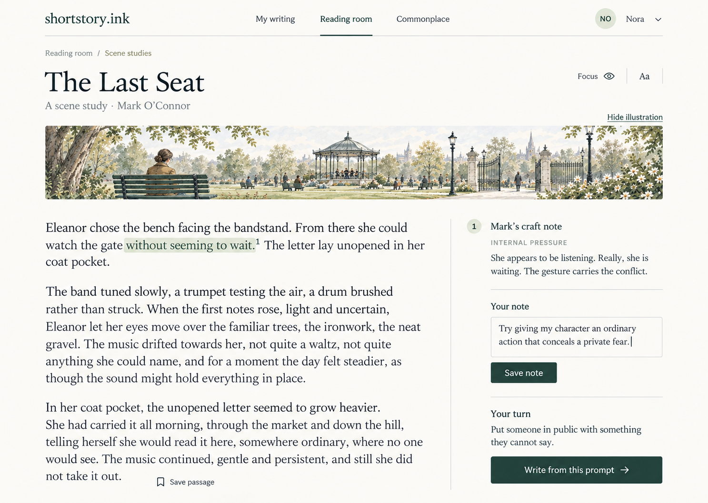
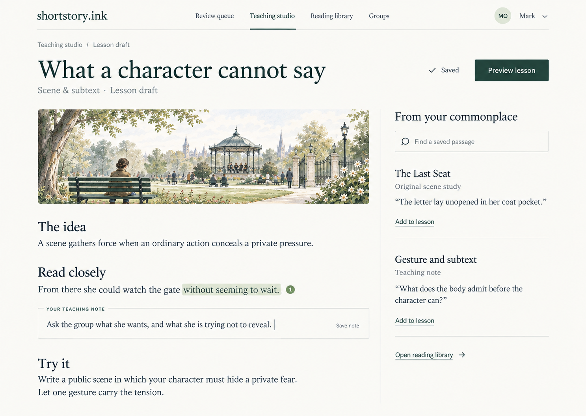

# Combined direction — Literary Journal and Reading Garden

9 September 2026. Historical design exploration record.

**Status update, 10 September:** the later [implementation handoff](../../handoff-literary-redesign-2026-09-09.md) records Mark’s subsequent approval to build this direction. Application changes now exist on `redesign/literary-reading-studio`. The review-only statements below describe the original proposal stage; consult the handoff for current validation and preview status.

Mark preferred the first round's Literary Journal combined with elements of the Reading Garden/reading room, and requested further mockups across different areas. This is a coherent direction expressed through three screens, not three competing alternatives. No implementation has been authorised.

Open [the current browser gallery](mockups.html). The [original comparison](first-round-mockups.html) is retained. The [performance and design report](report.md) remains the baseline review.

## How the combination works

Keep the journal as the foundation: flat warm ivory, readable dark green-charcoal text, generous margins, strong serif typography, fine rules and one primary navigation. Use illustration to introduce a particular reading or prompt, rather than decorating every screen. Everyday manuscripts and feedback should also work beautifully without an image.

The three mockups use the same park scene to demonstrate continuity from invitation, through close reading, to lesson preparation. The intended product is not permanently park-themed; each lesson can have its own appropriate imagery, or none.

### A writer's home

Give the returning writer one obvious action: continue the current draft. Put recent pieces in simple rows, with clear draft/feedback states. A modest reading-room invitation introduces imagination alongside the work, without taking it over.

### The reading room

A shallow, hideable illustration sets the scene. The text remains central. A passage connects to Mark's craft note, a separate personal note, and a prompt to try in the writer's own work. Maintain separate ownership of teacher annotations and student notes. Numbered marks replace the first round's connector that crossed the text.

### Your teaching studio

Build the lesson as a readable document: the idea, a passage to inspect, an in-place teaching note, and an exercise. The margin offers saved passages with source context and a direct Add to lesson action. Preview is the main action; sharing/publishing remains deliberate. This connects the existing snippet/document ambitions in the teacher roadmap.

## Applying the direction to the remaining areas

| Area | Treatment |
| --- | --- |
| Draft editor | Quiet journal typography, minimal editing controls, clear save state; optional prompt beside the page; no required illustration. |
| Feedback and revision | Same manuscript surface with aligned notes, clear version label and a separate Begin revision action; preserve the published original. |
| Teacher review queue | Simple rows showing writer, piece, status and next action; one navigation row; no decorative illustration needed. |
| Commonplace / reading library | Searchable, source-labelled passage lists, with image previews only when they identify a reading meaningfully. |
| Public home | Carry over light typography and a single inviting literary image; explain the read–notice–write–revise loop. |
| Mobile | One text column; notes expand inline or in a labelled sheet; illustration can collapse; compact navigation. Separate mobile mockups and interaction testing remain future work. |

## Decisions to resolve before implementation

- These images are concepts, not working controls. Commonplace for students, persistent personal reading notes, prompt-to-draft transfer and resuming multiple saved drafts need an explicit feature/data-model check; the mockups do not establish that those features already exist.
- A Saved indicator must state the actual persistence guarantee (for example, on this device versus saved to the account). Do not imply cloud saving merely because the image says Saved.
- In the reading mockup, Save note should be visually secondary to Write from this prompt; the generated image gives both filled buttons. In the teacher mockup, Saved and an actively edited note also need a precise dirty/saved state model.
- The teacher illustration is larger than the intended quiet vignette. Reduce or collapse it during editing so the lesson document gets more room.
- Normalise the slight generated typography differences between screens into two actual font families, one control system and a shared spacing scale.
- Existing student feedback stays attached to its exact source text/version. A design change must preserve anchors, line endings, manuscript ownership, publication privacy and revision history.
- Illustrations should be optimised static assets loaded appropriately; they should not delay the manuscript or add page-turn effects. The performance priorities in the original report remain open.

## Handoff and artifacts

- Selected direction: Literary Journal foundation plus restrained Reading Garden imagery and teaching interactions. Mark has requested further exploration, not a build.
- Three images generated with the built-in Image Gen tool; all use fictional example content. References were the two selected first-round mocks; the second and third also used the new writer-home image to keep styling consistent.
- Exact prompts are saved in [combined-generation-prompts.json](combined-generation-prompts.json). Images are saved under `images/combined-*.png`.
- `mockups.html` now opens the combined direction; `first-round-mockups.html` preserves the old gallery. Both are static image viewers outside application routes.
- No application source edits, dependency changes, database writes, configuration changes or deployments. Review files remain local and uncommitted.
