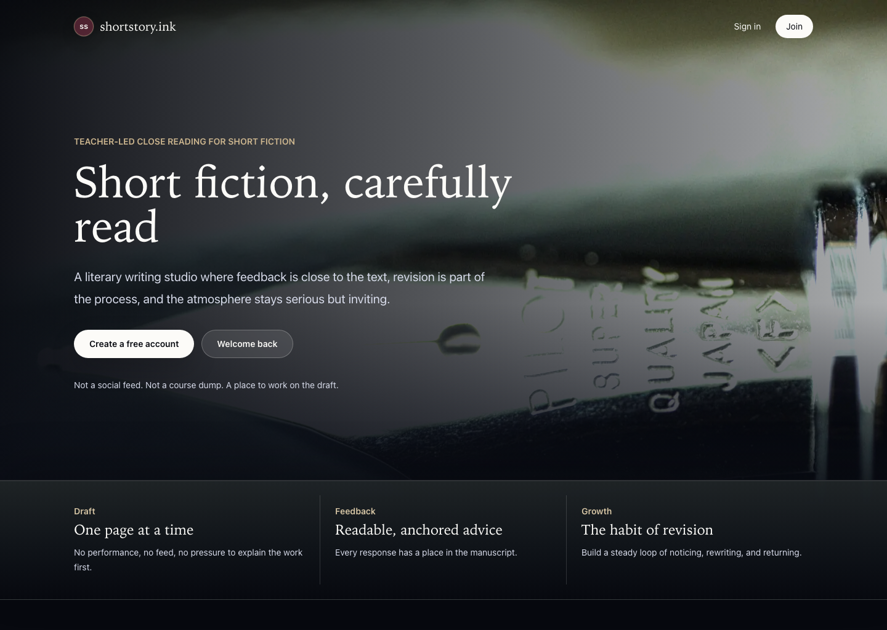
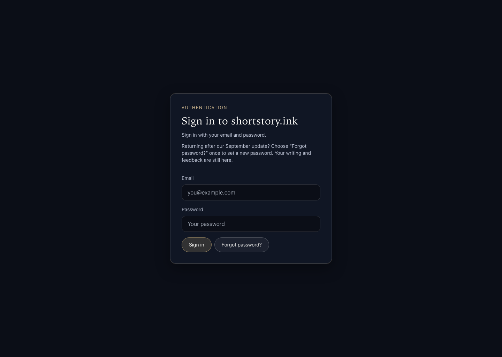
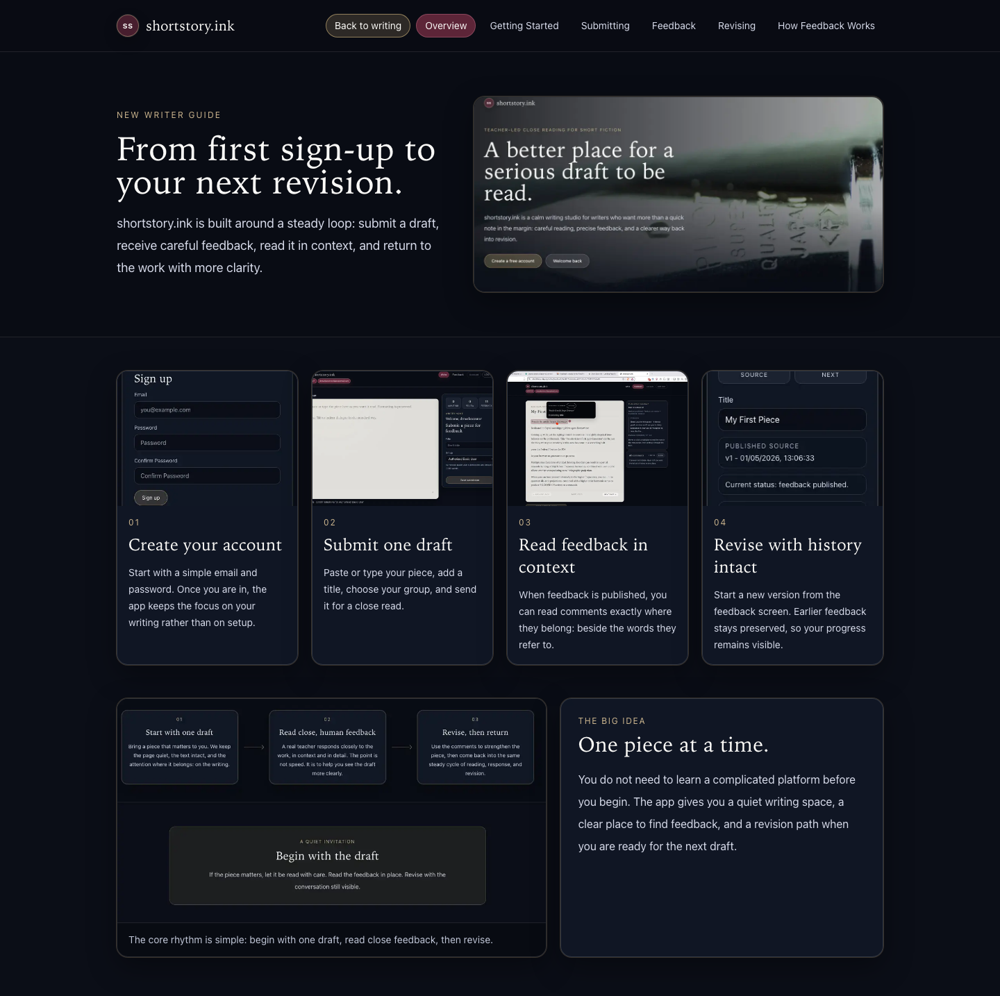
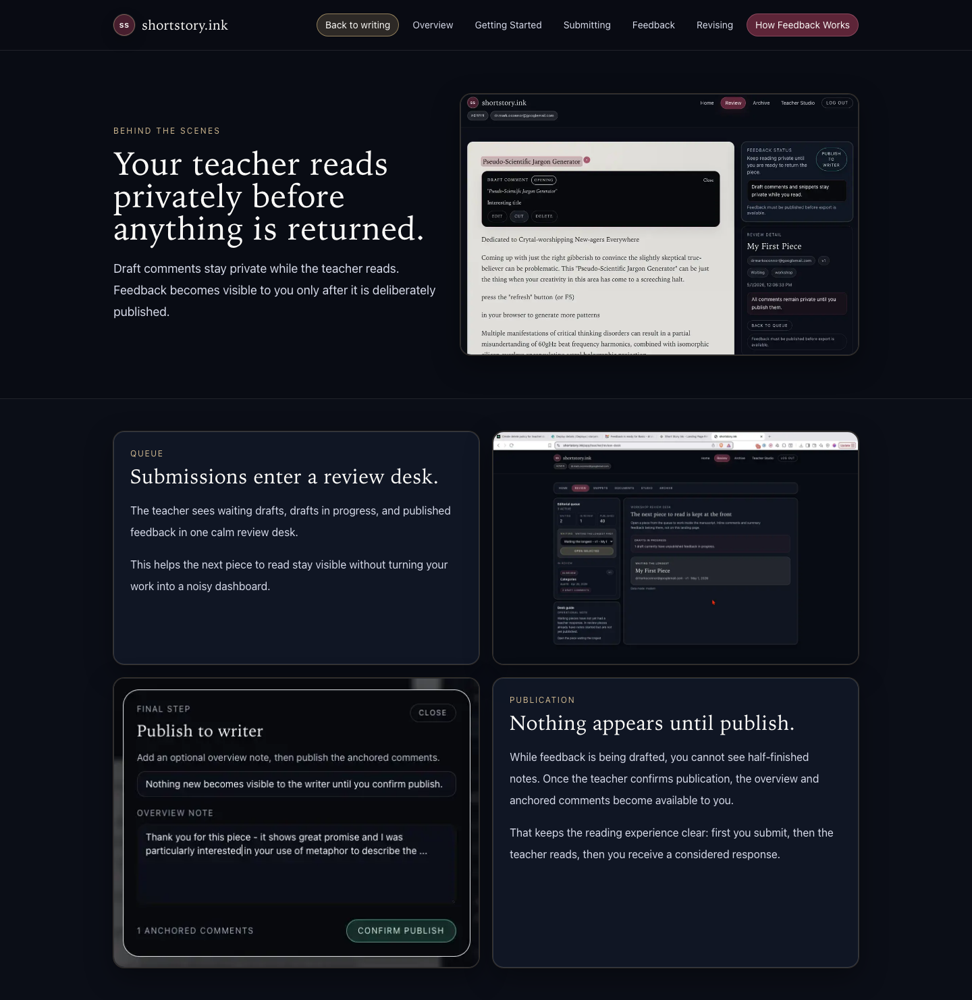
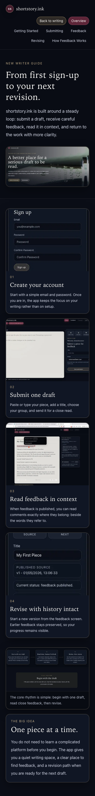
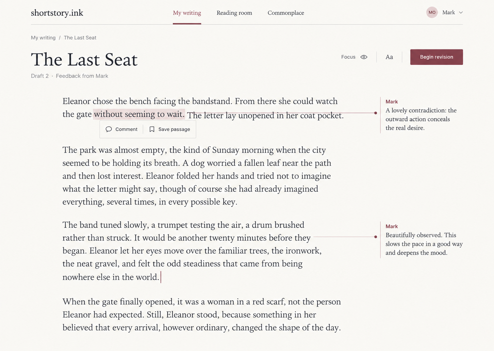
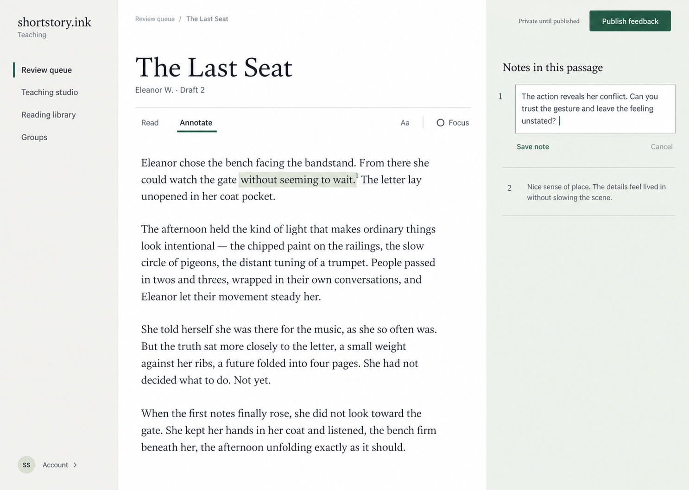
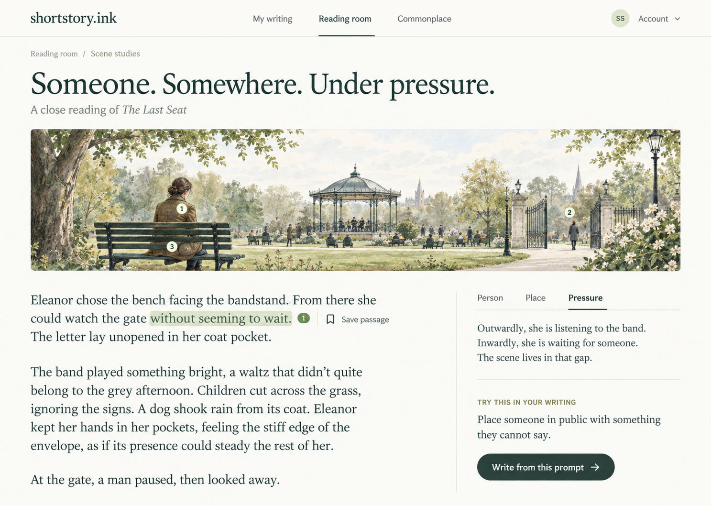

# shortstory.ink — performance and design review

9 September 2026 · Reviewed application commit `ca4547d`; repository `eaa1274`.

**Recommendation: keep Netlify, reduce unnecessary work on page visits, and simplify the interface around a bright manuscript and precise notes.** The migration solved manual database restoration. It did not, by itself, optimise the application's request sequence or its navigation.

This is a review and three visual proposals. No application code, production configuration, database data or account settings were changed. No deployment, account creation or email was performed. Review files are local deliverables and have not been committed or pushed.

Mark's latest preference for a lighter, fresher interface supersedes the original product brief's “dark-mode-first” direction. Its central principles still apply: elegance, adult literary seriousness, reading comfort, teacher efficiency, and feedback attached to the text.

## What was measured

Three sequential public HTTP requests per route, from this workstation with a fresh curl connection per request. Values below are complete HTML response times, **not** full browser render times, Core Web Vitals or authenticated workspace performance. The first sample is not proof of a cold database or cold function.

| Route | First request | Second | Third | Result |
| --- | ---: | ---: | ---: | --- |
| Homepage | 5.767s | 0.700s | 0.668s | HTTP 200 |
| Sign in | 1.764s | 0.720s | 0.592s | HTTP 200 |
| New writer guide | 0.417s | 0.276s | 0.678s | HTTP 200 |
| Teacher review desk, signed out | 1.514s | 0.589s | 0.525s | HTTP 307 to sign in |

The slow homepage sample spent 5.737s waiting for its first response byte; only about 30ms remained to receive the HTML. TLS timing varied too, so these numbers include network conditions. The homepage is prerendered in the local build manifest and contains no writing-database query. Its delay therefore cannot be attributed to waking the writing database.

A separate fresh Chromium capture recorded homepage load at 1.60s, sign-in at 2.73s and guide at 0.73s. This confirms variability, but does not isolate its cause. Later header checks showed Next.js and Netlify Durable cache hits on the homepage and guide, with an edge-cache miss. Sign-in was private/no-store and bypassed the durable cache, as expected. Do not disable private caching protections to chase a faster number.

Raw public measurements: [http-timings.json](http-timings.json). Browser evidence was captured at desktop 1440 × 1024 and mobile 390 × 844. Only the public guide was checked at mobile size; it had no horizontal overflow.

**Limits:** no authenticated browser session was available, so I did not measure teacher/writer page response times, query execution plans, cold versus warm production database performance, or editing responsiveness inside a signed-in session. Netlify management reads returned HTTP 429 for site metadata and HTTP 500 for branch metadata; current region and compute settings could not be independently rechecked. Those management errors are not evidence that student requests fail.

The earlier migration rehearsal recorded an idle database waking and querying in 1.868s. That is historical evidence, not a measurement from this review. Automatic sleep/wake can add a first-visit delay. Netlify's current documentation also distinguishes plan permissions for sleep/compute configuration; do not assume Personal permits a longer timeout or suggest an upgrade before measuring the application. [Netlify Database troubleshooting](https://docs.netlify.com/build/data-and-storage/netlify-database/troubleshooting/).

## Performance findings, in priority order

### 1. Each logical database query involves substantial repeated setup

**Confirmed in code; high-priority candidate for improvement.** `lib/data/client.ts:7` starts a transaction, sets session options, sets the verified user ID, sets the restricted role, runs the query and commits. That is six sequential driver calls for a normal restricted query, five for an administrative query. This is safe isolation scaffolding, but it is expensive when repeated many times on a page.

`app/app/teacher/review-desk/page.tsx:148` then loads the queue, author names, revision chains, feedback counts and published count largely sequentially. The manuscript page (`app/app/workshop/[submissionId]/page.tsx:216`) can load nine datasets in sequence. Including the account-map and profile lookup, a populated manuscript path can reach roughly **64 awaited driver calls**. This is a static count for that conditional path, not a measured network trace or a guarantee of 64 independent TCP round trips.

**Proposed fix:** introduce small, typed page-data loaders that batch related reads inside one correctly scoped transaction, and parallelise genuinely independent loads with a bounded connection budget. Prefer aggregate SQL for counts instead of transferring every feedback row. Preserve verified IDs, RLS roles, transaction-local settings, manuscript fidelity and publication locks. Do not remove transactions globally or share a connection's user state across concurrent requests. Next.js documents the distinction between sequential and parallel fetching. [Next.js 15 fetching data](https://nextjs.org/docs/15/app/getting-started/fetching-data).

### 2. Reading a page repeatedly performs account preparation

**Confirmed in code.** `getStudioUser()` (`lib/auth/studio-user.ts:10`) performs an advisory lock and `FOR UPDATE` lookup even for an already mapped, unchanged account. React `cache()` correctly deduplicates this within a render; it does not eliminate the work on subsequent navigations. The same is true for the profile cache: repeated imports do not imply repeated identical profile queries within the same render.

Every writer profile load calls `ensureAbuMembership()` (`lib/auth/get-current-profile.ts:50`), which looks up the default group and attempts an idempotent insert. Opening the teacher Groups page calls `ensureAbuMembershipForAllProfiles()` (`app/teacher/page.tsx:75`), repeating a backfill across profiles.

**Proposed fix:** use a fast read path for an existing verified mapping; enter the locked path only when provisioning, attaching an account or synchronising verified email. Move group preparation to controlled provisioning/membership operations, with a repair path for missing membership. Keep blocked-account, verified-email and ambiguous-account checks intact. This should reduce latency and write activity without buying more compute.

### 3. Manuscripts wait for supporting libraries they may never use

**Confirmed in code.** Opening a teacher manuscript eagerly fetches up to 2,000 snippets (`app/app/workshop/[submissionId]/page.tsx:388` and `lib/teacher-library/query-limits.ts:1`), plus other work and feedback memory. The teacher Studio already parallelises four independent loads—keep that good pattern—but retrieves a large snippet collection to calculate overview metrics.

The writer home fetches up to 80 full document bodies, filters group visibility on the server, then presents at most 12 summaries (`app/writer/page.tsx:417`). The server filter is not, by itself, evidence of a client data leak. However, this design moves unnecessary text and can omit an older relevant document if 80 newer unrelated documents precede it.

**Proposed fix:** load the current manuscript and its comments first. Fetch/search supporting libraries when opened, with pagination. Store/query document visibility metadata directly so database filtering happens before the limit and only the necessary summary fields are returned. Keep this authorisation server-side. Measure response size and hydration before attributing the issue to React or editor libraries.

### 4. Loading feedback and navigation are working against each other

**Confirmed structure; perceived impact still needs signed-in testing.** `app/app/layout.tsx` awaits the full profile path before rendering the shell. The existing `app/app/loading.tsx` is inside that layout and cannot cover its initial account-loading wait. `components/prototype/menu-tabs.tsx:22` also disables prefetch on all secondary navigation links.

**Proposed fix:** provide a stable loading shell at the boundary that actually waits, and progressively reveal manuscript versus optional side content. Restore selective prefetch after removing preparation writes from page loads; indiscriminate prefetch today could amplify database work. Preserve a consistent active location and an immediate pending state. A loading indicator improves perceived responsiveness; query reduction improves actual latency. [Next.js streaming guidance](https://nextjs.org/docs/app/getting-started/fetching-data).

### 5. Retire old-schema detection; defer minor optimisations until measured

`app/writer/page.tsx:101` queries a submission to detect a legacy schema on each writer visit. Production now has an explicitly applied native baseline. Review and remove obsolete schema fallbacks in a separate, tested cleanup. Also remove the unused Supabase image-host allowlist eventually; it does not itself contact Supabase or explain slow pages.

The root `IdentityLifecycle` runs on public pages as well as private pages. Inspect its real network and bundle cost before splitting it; preserve recovery and confirmation behaviour. The existing connection singleton, request memoisation, parameterised SQL and memoised manuscript pagination are sensible. I found no basis here to replace the framework or database again.

## Design and navigation review

### Captured steps

1. **Arrival — clear proposition, heavy atmosphere.** The homepage establishes literary seriousness and has clear sign-in/join actions. Its large dark photographic treatment makes returning feel more ceremonial than practical. A restrained wordmark and brighter work surface can preserve the literary identity.

2. **Sign in — understandable form, incomplete escape routes.** Visible labels and recovery guidance are useful. There is no visible home link, registration link or persistent wordmark link. “Authentication” is a system label, and the primary action is visually weak against the dark panel. Use a short welcoming title, a stronger primary action and discreet routes home and to account creation.

3. **Guide overview — coherent learning sequence, crowded presentation.** The four-step learning loop is valuable. Heavy outlined cards and pictures of already complex screens repeat interface clutter. The embedded homepage picture has an earlier headline; current navigation labels also differ from guide illustrations. Treat those embedded pictures as documentation illustrations, not authenticated current-screen evidence.

4. **Understanding feedback — reassuring explanation, weak visual teaching aid.** The text clearly explains private drafting and deliberate publication. The embedded screenshots become difficult to read at the displayed scale. Prefer a focused illustrated example of one sentence and one note, with an optional full-size demonstration.

5. **Enter the actual workshop — blocked by sign-in in the audit browser.** The route correctly redirects to sign-in. No authenticated teacher, student, annotation, revision or publication interaction was performed in this review. The duplicate sign-in screenshot from this step is excluded from the accepted screenshot set.

6. **Mobile guide — reflows successfully, navigation needs simplification.** No horizontal overflow at 390px. The header wraps into several rows and the screenshots become tiny. Use a compact section menu, retain an obvious back-to-studio action, and keep guide text useful without requiring the screenshots to be readable.

### Functional findings supported by source inspection

- **Two competing navigation rows.** `AppFrame` presents Review, Groups, Studio, Memory, Examples, Archive and Account; several pages also render `teacherTabs`, repeating five of these. This hierarchy makes neighbouring controls look equally important. Keep one primary navigation and use local tabs only for views within the current task.
- **Labels require remembering internal distinctions.** “Studio”, “Memory”, “Examples”, “Materials” and “Finished Pieces” do not consistently explain whether to prepare a lesson, find a passage, read feedback or resume a draft. “Finished Pieces” is particularly awkward for work that still invites revision.
- **The reading decoration competes with the text.** `app/globals.css:25` gives the folio rounded corners, multiple shadows and gradients. The example reader adds a simulated book spine and 680ms page-turn animation. This supports Mark's report of a cartoonish feel, but I did not observe those authenticated animations live. The turn also uses a 720ms cleanup timer. Prefer continuous reading, with optional simple pagination; page-turn animation is distinct from network page loading.
- **Small status labels and fleeting messages.** Several controls/statuses use 10–11px uppercase type. Review notices can disappear after 650ms (`components/teacher/review-workspace.tsx:425`). Important save/error states should remain until the user can read them; reserve brief disappearance for nonessential acknowledgements.
- **Good interaction foundations to preserve.** Selection handling includes keyboard events; annotation controls have labels; manuscript pagination is memoised. The book effect already has a reduced-motion rule. Existing publication privacy, version history and exact anchors are the valuable product, regardless of the surface design.

### Proposed information architecture

| Audience | Primary navigation | Secondary details |
| --- | --- | --- |
| Writer | My writing · Reading room · Commonplace | My writing contains Drafts, Feedback and Revisions. Reading room contains Materials and Annotated examples. |
| Teacher | Review queue · Teaching studio · Reading library · Groups | Studio contains lesson documents, prompts and reusable feedback. Library contains sources, saved passages and examples. |

Account, help and sign-out belong in a consistent account/menu area. Archive should normally be a filter or view of its relevant collection. A teacher/writer mode switch should only appear if the permissions model actually supports both workflows. Mockups showing Commonplace anticipate the product brief; a redesign must not imply that a complete student commonplace feature already exists.

### Reading and accessibility requirements for any chosen design

Use a flat warm-white surface, dark readable text and restrained coloured marks; offer dim mode as a preference. Start with roughly 18–20px manuscript text, 14–16px controls, 60–68 characters per line and comfortable line spacing. Preserve font-size/focus controls and check the layout at 200% zoom.

Keep selection and editing in place. On desktop, align notes with the selected passage in a margin. On mobile, use an accessible inline expansion or bottom sheet with explicit close/return-to-passage behaviour. Avoid covering the sentence with its note. Keep a stable path back to the source and the revision history.

Do not rely on colour or hover alone: visible numbered markers, focus states and keyboard operation should complement highlights. Source inspection found no `aria-current` in the two navigation components; add it when implementing. The pulse effect needs a reduced-motion review beyond the existing book-specific rule. Contrast, touch selection, focus return and screen-reader behaviour still require actual testing; neither screenshots nor mockups establish WCAG compliance.

## Three unimplemented visual directions

Each is a separate generated mockup, displayed in this order in the conversation. The shared source was the newly captured public homepage; private screens were grounded in source structure, not a claimed signed-in capture. All manuscripts and names in the concepts are fictional. Generated typography, text and geometry are art direction, not a finished interface specification.

### Option 1 — The Literary Journal

A bright continuous manuscript with a minimal top navigation and quiet marginal notes. Strongest expression of literary calm for students reading feedback and returning to a draft.

**Refine before building:** the generated connector crosses a line of prose and resembles a deletion. Keep all connectors in the margin. The example account label and editing state must also be reconciled with the actual writer role; beginning a revision must create a separate version rather than silently editing a published source.

### Option 2 — The Editorial Desk

A clear teacher workspace with one navigation column, a dominant manuscript and a quiet editable notes margin. Strongest practical foundation for Mark's daily reviewing and lesson preparation.

**Refine before building:** collapse the navigation in Focus mode and adapt the notes margin carefully on narrow screens. Retain the existing deliberate publication confirmation after the Publish feedback action. The editing caret represents editing a comment, not changing a student's manuscript.

### Option 3 — The Reading Garden

An illustrated scene study connecting a person, a place and pressure to an anchored craft note and a writing prompt. This develops the imagination-park idea with grown-up illustration and restrained interaction.

**Refine before building:** provide text equivalents for hotspots, keep annotation and hotspot numbering consistent, and let the illustration collapse while reading. This is a future lesson format, not a replacement for every manuscript screen. The mock uses an original scene rather than presenting invented prose as Miss Brill.

**Recommended combination:** use the clarity of Option 2 for teaching, the quieter reading treatment of Option 1 for students, and Option 3 as a later scene-study format. Share typography, spacing, controls and navigation conventions across them; do not build three separate visual systems.

## Proposed next work, after Mark chooses

1. Profile an authorised signed-in teacher and writer session, timing Identity verification, account mapping, query setup, actual SQL, rendering and page transition separately. Sample both first use after idle and repeat visits. Record counts and durations, not manuscript content or tokens.
2. Remove page-read backfills, batch/parallelise related reads and defer supporting libraries. Preserve the established permission, publication and concurrent-save tests. Add only focused tests for changed provisioning and loading behaviour.
3. Compare the same pages before/after. A reasonable target is a visible navigation response within 100–200ms and useful warm workspace content near one second on the same test connection; these are targets, not promises or measured current results. Record median and slower-percentile behaviour over enough samples; three public requests cannot establish a p95.
4. Implement the selected visual direction in a reviewable preview, beginning with the reading/review surface and a single navigation hierarchy. Validate keyboard/touch selection, long manuscripts, overlapping notes, narrow screens and revision history before production.
5. Prototype one illustrated scene lesson only after the everyday reading and teaching path is clear and responsive.

## Handoff / change notes

- Scope: code review, public read-only measurements, public screenshot audit, and exactly three image mockups. Mark explicitly said not to change code; that constraint remains active. Permission to use the separate browser and read-only checks does not authorise implementation.
- In-app browser discovery returned no connections. Mark authorised a separate automated Chromium browser. It used an isolated signed-out context and was closed afterwards.
- No production writes, identity changes, test accounts, emails, configuration changes, installs, builds, commits, pushes or deployments were performed for this review.
- New files are limited to this report directory: this report, three generated images, five accepted screenshots, and public HTTP measurements. Temporary review scripts live in `/private/tmp/`; additional evidence is under ignored `.local-backups/2026-09-09-performance-review/`.
- Images were made with the built-in Image Gen tool. Art direction: flat light literary surfaces, one primary task, original park prose, anchored comments, readable serif manuscript plus sans-serif controls, minimal navigation; differentiated as open journal, three-column editorial desk, and illustrated scene study. Original generated files remain in `/Users/moc/.codex/generated_images/01a081da-29c8-77b1-8e96-f966395515fc/`.
- Do not convert this report's likely causes into claimed measured authenticated bottlenecks. Do not edit the applied production baseline migration. Add any future schema changes as new migrations.
- Pending decision: Mark's preferred visual direction and authorisation for a separate implementation phase. No design has been selected yet.
